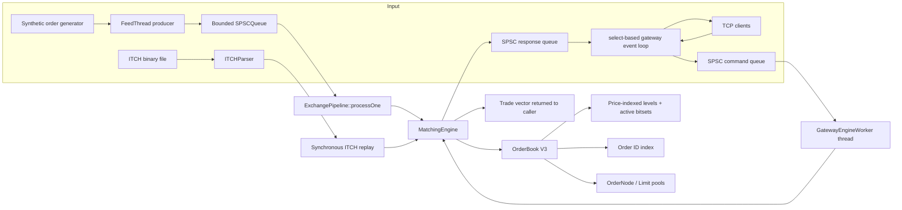

# Baseline architecture

## Components

- **Order model:** `Order` carries ID, side, limit/market type, integer price ticks, remaining quantity, and timestamp. `Trade` represents a match emitted by the matching engine.
- **Book variants:** V1 uses ordered price maps and deques. V2 uses ordered maps, FIFO linked lists, an ID index with node pointers, and pools. V3 uses direct arrays indexed by a bounded price domain, bitsets for active prices, an ID index, and pools. V3 is the book embedded in `MatchingEngine`.
- **Matching:** incoming orders consume the opposite best price while crossing conditions hold. Each price level is FIFO; trades use the resting order's price. Remaining limit quantity can rest on the book.
- **Allocation:** V2/V3 use fixed-capacity `PoolAllocator` instances for order nodes and price levels. The allocator itself has a free-list stack and is not thread-safe.
- **Concurrent synthetic input:** `FeedThread` is one producer for `SPSCQueue`; the main thread consumes orders and invokes the engine. The queue's full state is reported to the producer as `false`; `FeedThread` retries by spinning.
- **ITCH input:** `ITCHParser` converts selected binary message records. In file mode, `main.cpp` sends Add Order records to matching; other recognized records are counted only.
- **Outputs:** matching trades are accumulated by the caller. The baseline has no separate event stream, gateway, or engine-owned worker thread.

`ExchangePipeline<N>` is the queued single-writer path used by synthetic mode: one producer enqueues orders and one designated consumer calls `processOne`, which owns and mutates the matching engine. Queue-full is explicit as a false return; `FeedThread` retries and shutdown can interrupt that retry. ITCH replay remains synchronous.

The TCP path has a single `select` event-loop thread for up to 32 clients. That thread parses and serializes all incoming commands before putting them into the command SPSC queue; it is the sole producer. `GatewayEngineWorker` is the sole consumer and owns the matching engine. It sends acknowledgements and trade events through a second SPSC queue; the gateway thread routes events by connection token. A loopback UDP wakeup socket notifies the `select` loop when engine responses are available. If the command queue is full, the gateway explicitly rejects that request. If the event queue fills, the engine worker applies backpressure until the gateway drains it.
